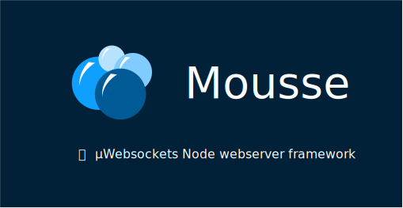

<p align="center">
  
</p>

<p align="center">
  
  
</p>


Mousse is a Node.js webserver framework developed in TypeScript and based on [µWebSockets.js](https://github.com/uNetworking/uWebSockets.js). It provides simple ways to route HTTP requests and handle WebSockets or Server-Sent Events through a single, consistent `Context` API. It uses a middlewares-based structure and handlers as inspired by [expressJS](https://expressjs.com/) and [fastify](https://fastify.dev/).

> In french Mousse refers to soap foam, composed of thousands bubbles : the requests 🫧

## Features

- ⚡ Built on µWebSockets.js, one of the fastest HTTP/WS servers available for Node.js
- 🌐 HTTP routing with parameters, wildcards, route options and composable routers
- 🔌 WebSockets with automatic upgrade, per-route events and backpressure handling
- 📡 Server-Sent Events as sustained requests, with backpressured send queue
- 🧩 Swappable modules per route or per router : body parser, response serializer, logger, error handlers
- 🛡️ Fully typed : request body, response, route params and context extensions
- ✅ Schema validation through [Standard Schema](https://standardschema.dev) : bring your Zod, ArkType or Valibot schemas as-is, get runtime validation and type inference
- 📄 Documentation generation from route schemas : self-styled HTML site or standard OpenAPI 3.1 output
- 🧪 One-call route testing : `router.test()` fires real requests through a single ephemeral instance, no port management


## Quick Start

```ts
import { Mousse } from 'mousse';

new Mousse()
	.get('/hello', (c) => {
		return 'Hello World !';
	})
	.get('/users/:id', (c) => {
		return { id: c.param('id') };
	})
	.post('/echo', async (c) => {
		return await c.body();
	})
	.ws('/chat', (c) => {
		c.onMessage((ws, message) => ws.send(message));
	})
	.sse('/events', (c) => {
		c.send('welcome');
	})
	.listen(3000, (ls, port) => {
		if (ls) console.log(`Listening on port ${port}`);
	});
```

`c` is a `Context` instance : it wraps the request and the response and carries every utility you need. A handler may respond explicitly (`c.respond()`, `c.json()`...) or simply return a value.

Every registration method returns the app itself, so the whole application can be chained — and stopped with `app.stop()`, which closes the listen socket while letting in-flight work finish.

## TLS

Pass the µWebSockets.js SSL options to the constructor. When both `key_file_name` and `cert_file_name` are provided, Mousse automatically creates an SSL application:

```ts
const app = new Mousse({
	key_file_name: 'misc/key.pem',
	cert_file_name: 'misc/cert.pem',
	passphrase: '1234'
});
```

## WebSockets and Server-Sent Events

Real-time channels use the same routing and `Context` API as HTTP. 

A `ws` route separates the **upgrade phase** — plain HTTP middlewares that can reject the connection by responding — from the **connected phase**, where the handler receives an already-open `WSContext` with events, pub/sub and automatic backpressure handling. 

```ts
app.ws('/chat/:room',
	(c) => {
		if (!c.getHeader('authorization')) return c.status(401).respond(); // upgrade rejected
	},
	(c) => {
		c.subscribe(c.param('room'));
		c.onMessage((ws, message) => c.publish(c.param('room'), message));
	});
```

An `sse` route hands you an already-sustained context: `c.send()` pushes events through a backpressured queue, and any regular route can open a channel itself with `c.sustain()`.


See [WebSockets](docs/websockets.md) and [Server-Sent Events](docs/server-sent-events.md).

## Validation and typing with schemas

Attach [Standard Schema](https://standardschema.dev) schemas (Zod, ArkType, Valibot...) to a route: requests are validated at runtime and the handler is fully typed from them — no generics to write.

```ts
import { z } from 'zod';

app.post('/orgs/:org/users', {
	schemas: {
		Body: z.object({ name: z.string(), email: z.string().email() }),
		Response: z.object({ id: z.number() })
	}
}, async (c) => {
	const body = await c.body();   // { name: string; email: string } — validated AND typed
	return { id: 1 };              // must match the Response schema
});
```

See [Schemas](docs/schemas.md) for what is validated and when, failure handling and inference details. The same schemas also feed the [documentation generators](docs/docgen.md).

## Documentation

1. [Routing](docs/routing.md) — routes, patterns, middlewares, routers, error handling
2. [Context](docs/context.md) — request and response API
3. [Server-Sent Events](docs/server-sent-events.md) — sustained requests
4. [WebSockets](docs/websockets.md) — upgrades, events, backpressure
5. [Modules](docs/modules.md) — body parsers, serializers, loggers, error handlers
6. [Typescript](docs/typescript.md) — context types and extensions
7. [Schemas](docs/schemas.md) — validation and type inference
8. [Testing routes](docs/testing.md) — firing requests against a router with no real port
9. [Documentation generation](docs/docgen.md) — HTML docs and OpenAPI output

## Monorepo

| Path | Content |
|---|---|
| [`packages/mousse`](packages/mousse) | The framework, with its unit tests |
| [`apps/examples`](apps/examples) | Runnable examples and the framework integration tests |
| [`apps/benchmarks`](apps/benchmarks) | Benchmarks against express, fastify and raw µWebSockets.js |

```sh
pnpm example            # list runnable examples
pnpm example schemas    # run one on http://localhost:8080
```

## Tests

```sh
pnpm test               # turbo run test : builds mousse first, then every suite
```

Two suites, run together by turbo :

- **Unit** — [`packages/mousse/tests`](packages/mousse/tests) : pure logic of the package (uri joining, query parsing, Standard Schema validation, JSON Schema rendering, doc translators).
- **Integration & examples** — [`apps/examples/tests`](apps/examples/tests) : real requests fired through `router.test()` covering routing, context, schemas, docgen, SSE — plus a real `listen(0)` + native `WebSocket` client for upgrades, and a smoke test of every example app ([executable documentation](docs/testing.md#dogfooding)).

Each one also runs alone with `pnpm --filter mousse test` or `pnpm --filter @mousse/examples test`. Tests are plain `node --test` : no test framework dependency.

## Benchmarks

`pnpm bench` spawns each server and fires [autocannon](https://github.com/mcollina/autocannon) at a plain-text route — 100 connections, 10 seconds, Node 24, same machine for all:

| Framework | req/s | avg latency | p99 latency |
|---|---:|---:|---:|
| **Mousse** | **41 085** | **2.16 ms** | **5 ms** |
| µWebSockets.js (raw) | 39 277 | 2.22 ms | 5 ms |
| node:http (raw) | 36 576 | 2.23 ms | 5 ms |
| koa | 31 352 | 2.68 ms | 5 ms |
| fastify | 30 286 | 2.72 ms | 7 ms |
| hono | 26 095 | 3.35 ms | 8 ms |
| express | 19 884 | 4.50 ms | 9 ms |

Mousse runs at raw µWebSockets.js speed — the two are within measurement noise of each other — while adding routing, middlewares, validation and the whole `Context` API. Every framework built on `node:http` starts below the second baseline; Mousse doesn't. Single 10-second runs, numbers vary with hardware and differences under ~5% aren't significant : run `pnpm bench` to reproduce on yours.

## Contributing

> Disclaimer : even though I'm proud of this version, it represents one of my first public, ambitious and TypeScript based modules. Many improvements need to be done and will be, I hope.

The simplest contribution is to test Mousse and [open issues](https://github.com/Tyrenn/mousse/issues) to help chase the bugs. For code contributions :

1. **Fork** the repository and create a branch from `main` :

	```sh
	git clone https://github.com/<you>/mousse
	cd mousse && pnpm install
	git checkout -b my-change
	```

2. **Make your change**, with tests. New feature → integration test in [`apps/examples/tests`](apps/examples/tests) (or a unit test in [`packages/mousse/tests`](packages/mousse/tests) for pure logic). Check everything locally :

	```sh
	pnpm build && pnpm check-types && pnpm test
	```

3. **Record your change** with a changeset — it describes the change and the version bump it deserves (patch/minor/major), and ends up in the changelog :

	```sh
	pnpm changeset
	```

	Answer the prompts, then commit the generated `.changeset/*.md` file along with your change.

4. **Open a Pull Request** against `main`. CI runs build, types and the full test suites.

### Releasing (maintainer)

Merged changesets accumulate on `main`. Releasing is manual, from an up-to-date `main` with npm credentials (`npm login`) :

```sh
pnpm changeset version                    # consume changesets : bump versions, write changelogs
git add -A && git commit -m "Version packages"
pnpm release                              # build + check-types + test, then changeset publish
git push --follow-tags                    # push the version commit and the release tags
```

## License

[MIT](LICENSE)